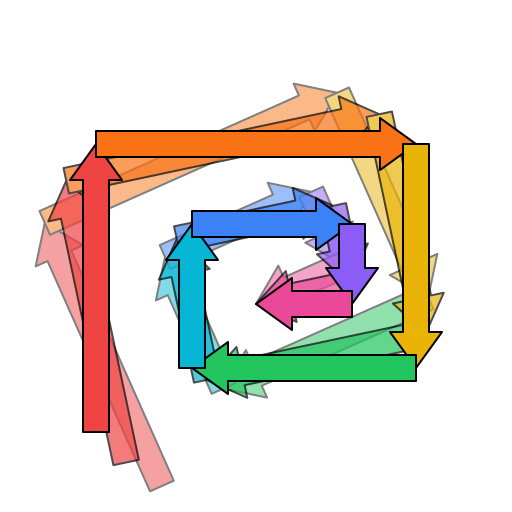
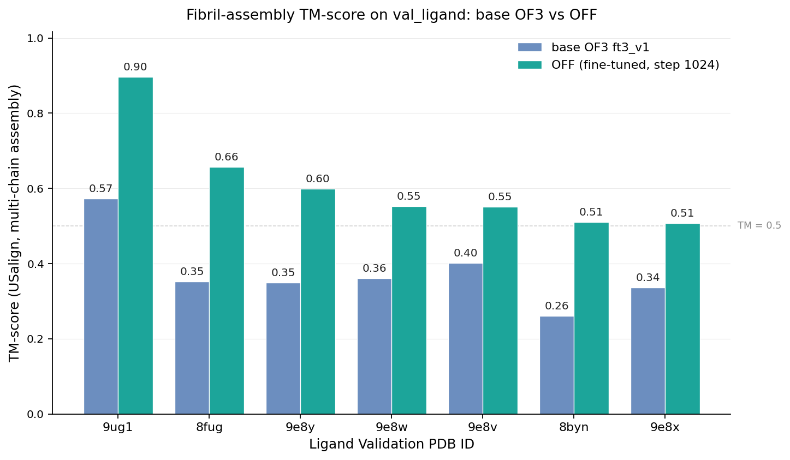
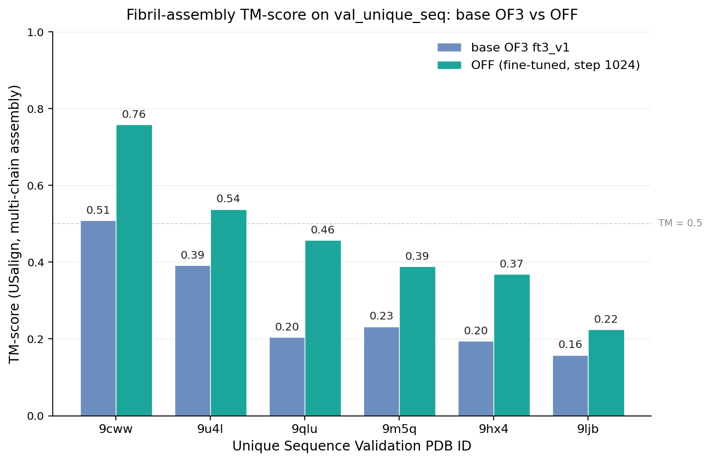
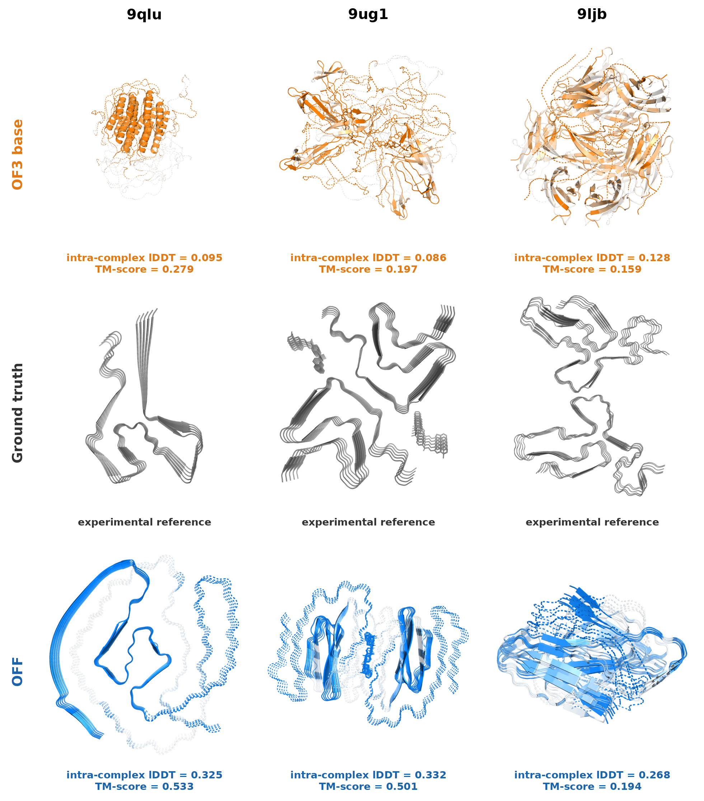

<p align="center">
  
</p>

<h1 align="center">OpenFibrilFold</h1>

<p align="center">
  <em>An OpenFold3 fine-tune for amyloid fibril structure prediction.</em>
</p>

<p align="center">
  <a href="https://github.com/aqlaboratory/openfold-3"></a>
  <a href="LICENSE"></a>
  
</p>

---

## Overview

OpenFibrilFold (OFF) adapts [OpenFold3](https://github.com/aqlaboratory/openfold-3) to the structural prediction problem of amyloid fibrils. OFF attempts to fix model collapse when predicting fibrils in complex with stacked small molecule ligands. OFF introduces:

- a **ribbon-symmetric crop** that preserves both faces of the cross-β stack during training,
- a **cross-ribbon distogram weight** that emphasizes the fold-defining inter-strand contacts,
- **polymorph-aware training and evaluation**, including per-sample best-matching ground-truth selection and a sample-diversity loss against fibril polymorphs,
- a **fibril-specific dataset** of publicly deposited PDB structures, curated for split cleanliness and binding-site diversity.

## Highlights

We split the held-out fibril set into two cohorts with different difficulty profiles. The Unique Sequences Validation Set (n=6) holds rare-fold apo and ligand fibrils on sequences never seen during training, isolating performance on novel folds. The Unique Ligands Validation Set (n=7) is exclusively ligand-bound fibrils, where small-molecule pose prediction is the harder objective — numbers below are reported per-cohort, never aggregated.

<p align="center">
  
</p>

<p align="center">
  
</p>

**Mean TM-score per dataloader (USalign, multi-chain complex):**

| Validation cohort | n | mean TM (OF3 base) | mean TM (OFF) | Δ |
| --- | ---: | ---: | ---: | ---: |
| Unique Ligands Validation Set     | 7 | 0.376 | **0.610** | **+0.235** |
| Unique Sequences Validation Set   | 6 | 0.282 | **0.456** | **+0.174** |

<!-- METRICS_TABLE_START -->
| Metric | OF3 base<br/>Unique Sequences Validation Set | OFF<br/>Unique Sequences Validation Set | OF3 base<br/>Unique Ligands Validation Set | OFF<br/>Unique Ligands Validation Set |
| --- | ---: | ---: | ---: | ---: |
| **Structure (lDDT / TM, ↑)** |  |  |  |  |
| Intra-protein lDDT | 0.477 | **0.538** | 0.477 | **0.679** |
| Inter-protein lDDT | 0.168 | **0.425** | 0.214 | **0.531** |
| Intra-complex lDDT | 0.477 | **0.538** | 0.480 | **0.681** |
| Mean TM-score (USalign, complex) | 0.282 | **0.456** | 0.376 | **0.610** |
| **Ligand (lDDT, ↑)** |  |  |  |  |
| Intra-ligand lDDT | — | — | 0.876 | **0.893** |
| Intra-ligand lDDT (uha) | — | — | 0.729 | **0.754** |
| Inter-ligand lDDT | — | — | 0.232 | **0.313** |
| Protein–ligand lDDT | — | — | 0.069 | **0.086** |
| **Geometric (↓ lower better; GDT ↑)** |  |  |  |  |
| Intra-protein dRMSD (Å) | 13.87 | **12.56** | 16.54 | **11.47** |
| Intra-ligand dRMSD (Å) | — | — | 0.800 | **0.698** |
| Complex RMSD (Å) | 25.63 | **20.84** | 34.74 | **17.83** |
| GDT-TS | 0.038 | **0.129** | 0.011 | **0.128** |
| GDT-HA | 0.006 | **0.053** | 0.002 | **0.060** |
| **Confidence (pLDDT magnitude, ↑)** |  |  |  |  |
| pLDDT (protein) | 0.280 | **0.316** | 0.233 | **0.546** |
| pLDDT (complex) | 0.280 | **0.316** | 0.231 | **0.535** |
| pLDDT (ligand) | — | — | 0.175 | **0.230** |
| **Confidence calibration — Pearson(lDDT, pLDDT)** |  |  |  |  |
| Pearson (protein) | 0.826 | 0.415 | -0.202 | 0.411 |
| Pearson (complex) | 0.826 | 0.415 | -0.124 | 0.362 |
| Pearson (ligand) | — | — | 0.144 | -0.517 |
<!-- METRICS_TABLE_END -->

## Head-to-head predictions

Three held-out fibrils, viewed end-on (looking straight down the protofilament stacking axis) so the cross-section that defines the fold is visible. **Top row:** OpenFold3 base. **Middle:** experimental cryo-EM ground truth. **Bottom:** OFF. The prediction panels are coloured by per-residue lDDT against the experimental reference — saturated colour = aligned, faded toward white = mis-aligned.

<!-- HEAD_TO_HEAD_START -->
<p align="center">
  
</p>
<!-- HEAD_TO_HEAD_END -->

## Methods in Brief

- **Backbone:** OpenFold3 trunk (Pairformer + diffusion module + confidence heads), unmodified.
- **Training set:** structures from the [Amyloid Atlas](https://people.mbi.ucla.edu/sawaya/amyloidatlas/), filtered for resolution and ribbon-axis-compatible chain count, then deduplicated by entity sequence.
- **Validation sets:** held out from more recent PDB depositions in two cohorts — the Unique Sequences Validation Set (entries whose protein sequence does not appear in training) and the Unique Ligands Validation Set (recent ligand-bound fibrils).
- **Polymorph determination:** as described in [RibbonFold (Guo et al., PNAS 2025)](https://www.pnas.org/doi/10.1073/pnas.2501321122) — two structures sharing sequence identity with mutual-Q < 0.4 are treated as distinct polymorphs.
- **Crop:** Crops are ribbon-symmetric.
- **Distogram:** explicit cross-ribbon weight on β-stacking pairs.
- **Hardware:** 3× NVIDIA RTX A6000 Ada (DDP), bf16-mixed precision, 32 diffusion samples per structure at train and val. End-to-end training in ~1 day.

For the full description, see [`docs/methods.md`](docs/methods.md).

## Limitations

OFF specializes in amyloid fibrils and offers no benefit over base OpenFold3 on general protein targets. The two validation cohorts hold only six and seven structures each, so the cohort averages carry wide uncertainty and we report individual PDB scores alongside the aggregates. Ligand placement remains the weakest aspect of the model, with very low protein to ligand lDDT and ligand pLDDT well below typical OpenFold3 confidence values.

## Upcoming

The following will be released alongside the public flip of this repository:

- **Curated fibril dataset** — preprocessed structures, splits, MSAs, ribbon assignments, and polymorph groups.
- **Trained model weights** — final OFF checkpoint and the inference config to use it.
- **Training scripts** — full reproducible training pipeline (data prep → stage 1 → stage 2 → eval), including the OpenFold3 patch set.
- **Manuscript / preprint** — describing the architectural changes, training recipe, and benchmarking results in detail.

## Acknowledgements

OFF is a fine-tune of [OpenFold3](https://github.com/aqlaboratory/openfold-3) (AQ Laboratory). Both OpenFold3 and the reference [AlphaFold 3](https://www.nature.com/articles/s41586-024-07487-w) algorithm are foundational to this work. Cross-β fibril structures used for training and validation come from depositions in the [Protein Data Bank](https://www.rcsb.org/).

## Citation

If this work is useful to you, please cite the repository:

```bibtex
@software{perez_openfibrilfold_2026,
  author       = {Perez, Ryann},
  title        = {OpenFibrilFold: an OpenFold3 fine-tune for amyloid fibril structure prediction},
  year         = {2026},
  publisher    = {GitHub},
  url          = {https://github.com/ryannmperez/OpenFibrilFold}
}
```

## License

[Apache 2.0](LICENSE).

## Release notes

- **2026-05-07** — initial private snapshot. Renamed from FibrilFold → OpenFibrilFold.
